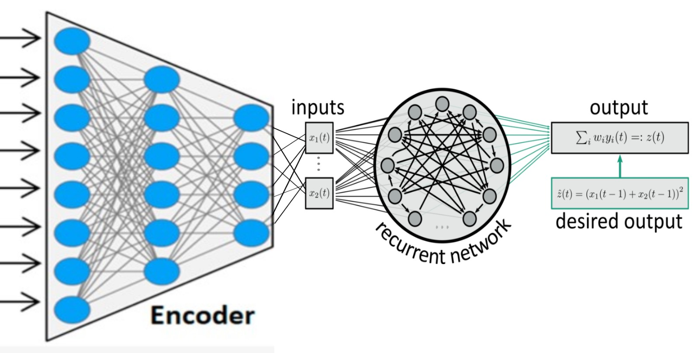

# Auto Encoder with ReservoirComputer

Welcome to the AE_ReservoirComputer repository!

This repository contains the implementation of an Artificial Echo Reservoir Computer, a type of machine learning model used for time series prediction and signal processing tasks. The reservoir computer architecture is based on the concept of a dynamical system with a large number of interconnected nodes, known as the reservoir.

## Structure


## Installation

To install the AE_ReservoirComputer package, simply run the following command:

```
pip install requirements.txt
```

## Usage

To use the AE_ReservoirComputer package in your project, import it as follows:

```python
from AE import Autoencoder
from rc import ESN
```

Then, you can create an instance of the reservoir computer and train it on your data. Here's an example:

```python
# Load MNIST data
mnist = fetch_openml('mnist_784', version=1)
X, y = mnist["data"], mnist["target"]

X = X / 255.0  # Normalize pixel values to range [0, 1]
X = np.array(X)
y = OneHotEncoder().fit_transform(y.values.reshape(-1, 1)).toarray()

# Split data into training and testing sets
X_train, X_test, y_train, y_test = train_test_split(X, y, test_size=0.2, random_state=42)

# Build and train autoencoder
input_dim = X_train.shape[1]
AE = Autoencoder(input_dim=input_dim)
autoencoder, encoder = AE.build_autoencoder()
autoencoder.fit(X_train, X_train, epochs=2, batch_size=256, shuffle=True, validation_split=0.2)

# Transform data using the encoder
X_train_encoded = encoder.predict(X_train)
X_test_encoded = encoder.predict(X_test)

# Initialize and train ESN
input_size = X_train_encoded.shape[1]
reservoir_size = 10
output_size = 10
esn = ESN(input_size, reservoir_size, output_size, alpha=0.99)
esn.train(X_train_encoded, y_train)

# Predict and evaluate
predictions = []
for i in X_test_encoded:
    predictions.append(esn.predict(i.reshape(1, -1)))
    #print(np.argmax(predictions))
predictions = np.array(predictions).reshape(-1, 10)
accuracy = np.mean(np.argmax(predictions, axis=1) == np.argmax(y_test, axis=1))
print("Accuracy:", accuracy)
print("The input dimension is:", X_train_encoded.shape[1])
